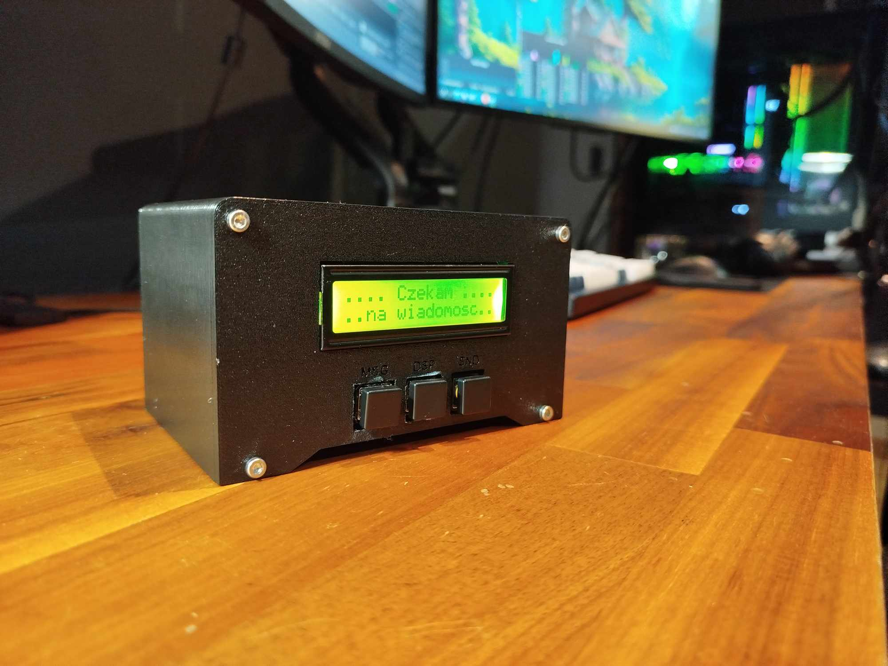
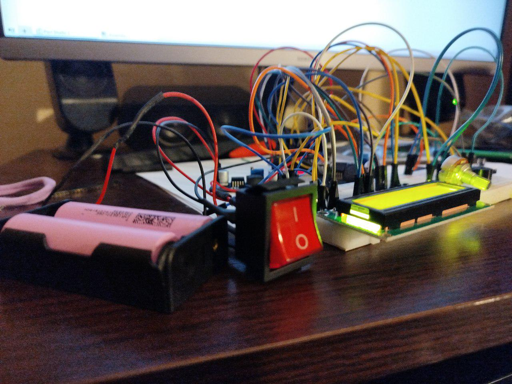

ESP32 Project with LCD, WiFi, and Buzzer

A project based on the ESP32 microcontroller that allows displaying text on an LCD, receiving text via HTTP, and interacting with buttons and a buzzer.

Requirements:
ESP32 – Development board based on ESP32
16x2 LCD Display – For displaying text
Buzzer – A speaker for sound signals
Buttons – For controlling silent mode, clearing the screen, and scrolling text
Wi-Fi – For internet connection and data reception
Libraries:
WiFi.h – Handles Wi-Fi connection
LiquidCrystal.h – Controls the LCD display
pitches.h – Tone definitions for the buzzer
Features:
Wi-Fi Connection: The ESP32 connects to a Wi-Fi network and displays the connection status on the LCD.

Images:

Button Control:

Button 1 (PIN 4) – Switches between "silent" and "loud" modes, controlling the buzzer.
Button 2 (PIN 12) – Clears the LCD screen.
Button 3 (PIN 17) – Displays the previous message.
HTTP Server: ESP32 listens on port 80 and receives data (text and author) via an HTML form. The data is displayed on the LCD screen.

Text Scrolling: If the text is longer than 16 characters, it scrolls across the LCD screen.

Sounds: The buzzer plays sounds indicating new messages, depending on the selected mode (loud/silent).

Installation:
Download the Code:

Download the code from the repository or copy it to the Arduino IDE.
Wi-Fi Configuration:

Modify the ssid and password in the code with your Wi-Fi credentials.
Libraries:

Install the necessary libraries in the Arduino IDE:
LiquidCrystal
WiFi
pitches (If you don’t have this library, create a file with this name containing the necessary tones)
Upload to ESP32:

Select the appropriate ESP32 board in the Arduino IDE.
Upload the code to the ESP32.
Usage:
Device Connections:

Connect the LCD display to pins 22, 23, 18, 19, 21, and 16.
Connect the buttons to pins 4, 12, and 17.
Connect the buzzer to pin 2.
Open the webpage:

After running the project, the ESP32 will display the IP address on the LCD.
Enter this IP address into your browser to open the form where you can submit text and author.
Button Interactions:

Button 1 – Toggles the sound mode (loud/silent).
Button 2 – Clears the screen.
Button 3 – Scrolls the previous message.
Additional Information:
3D Enclosure: A 3D enclosure has been designed for this project in AutoDesk, which can be downloaded in STL format. The enclosure files can be found in the 3D Printable Case/ folder of the repository.

Alternative Android App: There is also an alternative option to use the project via an Android application written in Kotlin. The app allows interaction with the ESP32 via Bluetooth or Wi-Fi and displays data on the Android screen. The app files are available in the Android_App/ folder of the repository.

Tips:
If you don’t see text on the LCD screen, check the pin connections and ensure the LCD is correctly configured.
Use the correct IP addresses to ensure the ESP32 device is accessible on the network.
Ensure the server is running and receiving data on port 80.
Pinout Diagram:
________________________________________________________________________________________________________________________________________
PIN ESP32  |  Device
-----------------------------
GPIO 22    |  RS LCD
GPIO 23    |  EN LCD
GPIO 18    |  D4 LCD
GPIO 19    |  D5 LCD
GPIO 21    |  D6 LCD
GPIO 16    |  D7 LCD
GPIO 2     |  Buzzer
GPIO 4     |  Button 1
GPIO 12    |  Button 2
GPIO 17    |  Button 3
________________________________________________________________________________________________________________________________________

Example Form:
After starting the HTTP server and connecting to the ESP32, a form will appear in your browser where you can enter text and author:

<form action="/" method="GET">
  Text: <input type="text" name="text" placeholder="Enter text for LCD">
  Author: <input type="text" name="author" placeholder="Enter author">
  <input type="submit" value="Submit">
</form>

License:
This project is released under the MIT License. You can modify and use it freely according to the terms of the license.
